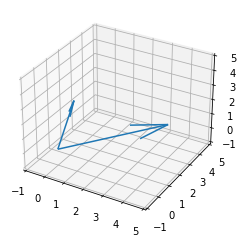
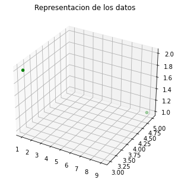

```{r setup, include=FALSE}
knitr::opts_chunk$set(echo = TRUE)
```


```{r, include=FALSE}
```


### **1.** Las siguientes son 5 medidas sobre las variables $x_1, x_2, x_3$:

```{r}
x1 = c(9, 2, 6, 5, 8)
x2 = c(12, 8, 6, 4, 10)
x3 = c(3, 4, 0, 2, 1)

df = data.frame(x1, x2, x3)
df
```

Se calcula las medias de cada variable, para obtener el vector de medias:

```{r}
X = colMeans(df)
X
```

Se calcula la matriz de covarianzas:

```{r}
S = cov(df)
S
```

Se calcula la matriz de correlación:

```{r}
R = cor(df)
R
```


<br /> 


### **2.** Sea $x' = [5, 1, 3]$ y $y' = [−1, 3, 1]$ 

<br /> 

#### a. Grafique los dos vectores.



<br /> 

#### b. Encuentre...

<br /> 

#### (i) la longitud de $x$


```{r}

x <- c(5, 1, 3)
y <- c(-1, 3, 1)

longitud_x = norm(x, type="2") 
longitud_x


```
<br /> 

#### (ii) el ángulo entre $x$ y $y$

```{r}

x <- c(5, 1, 3)
y <- c(-1, 3, 1)

angulo <- function(x,y){
  dot.prod <- x%*%y 
  norm.x <- norm(x,type="2")
  norm.y <- norm(y,type="2")
  theta <- acos(dot.prod / c(norm.x%*%norm.y))
  as.numeric(theta)
}


angulo_g = angulo(x,y)*(180/pi)
angulo_g

```
<br /> 

(iii) la proyección de y en x.

```{r}
x <- c(5, 1, 3)
y <- c(-1, 3, 1)
proyecccion = c( (x %*% y) / (norm(x, type="2"))^2 ) * x
proyecccion

```

<br /> 

#### c. Dado que $\bar{x} = 3$ y $\bar{y} = 1$, grafique [5 − 3, 1 − 3, 3 − 3] = [2, −2, 0] y [−1 − 1, 3 − 1, 1 − 1] = [−2, 2, 0]

<br /> 


<br /> 

### **3.** Sea: 

  <center>
  $\textbf{A}=
  \begin{bmatrix}
  9 & -2\\
  -2 & 6
  \end{bmatrix}$
  </center>
  
<br /> 

```{r}

x1 = c(9, -2)
x2 = c(-2, 6)

A = data.frame(x1, x2)
A
```

<br /> 

#### a. ¿Es **A** una matriz simétrica?

```{r}
t(A)
```

Como la transpuesta de la matriz es igual a la misma matriz (A = A^T), A es simetrica.

<br /> 

#### b. Muestre que **A** es definida positiva.

```{r}
lambda = eigen(A) 

lambda$values
```

Como todos los valores propios de A son positivos, A esta definida positiva.

<br /> 

#### c. Determine los valores y vectores propios de **A**.

Vectores propios:

```{r}
lambda$vectors
```

Valores propios:

```{r}
lambda$values
```

<br /> 

#### d. Encuentre la descomposición espectral de **A**.

Descomposición espectral de A:

```{r}
A_desc = (lambda$values[1]*lambda$vectors[,1]%*%t(lambda$vectors[,1])) + 
         (lambda$values[2]*lambda$vectors[,2]%*%t(lambda$vectors[,2]))

A_desc
```

<br /> 

#### e. Determine la inversa de **A**.

```{r}
inv_A = solve(A)
inv_A
```

<br /> 

#### f. Encuentre los valores y vectores propios de **A<sup>-1</sup>**.

```{r}
lambda_inv_A = eigen(inv_A) 
```

Vectores propios:

```{r}
lambda_inv_A$vectors
```

Valores propios:

```{r}
lambda_inv_A$values
```


<br /> 


### **4.** Verifique las relaciones V <sup> 1/2 </sup> $\rho$ V <sup> 1/2 </sup> = $\Sigma$ y $\rho$ = (V <sup> 1/2 </sup>)<sup> -1 </sup> $\Sigma$ (V <sup> 1/2 </sup>)<sup> -1 </sup>, donde **$\Sigma$** es el $p × p$ matriz de covarianza poblacional, **$\rho$** es la matriz de correlación poblacional $p × p$ y V <sup> 1/2 </sup> es la matriz de desviación estándar de la población.

<br />

Sea $V^{1/2}$ la matriz de desviacion estandar y $\rho$ la matriz de correlacion poblacional, tenemos que...

<br />

 $V^{1/2}\rho V^{1/2}$ = \begin{bmatrix}
\sqrt{\sigma_{11}} & ... & 0\\
... &  & ...\\
0 & ... & \sqrt{\sigma_{pp}}\\
\end{bmatrix} \begin{bmatrix}
1 & ... & \rho_{1p}\\
... &  & ...\\
\rho_{p1} & ... & 1\\
\end{bmatrix}\begin{bmatrix}
\sqrt{\sigma_{11}} & ... & 0\\
... &  & ...\\
0 & ... & \sqrt{\sigma_{pp}}\\
\end{bmatrix} = \begin{bmatrix}
\sqrt{\sigma_{11}}  & ... & \sqrt{\sigma_{11}} \rho_{1p} \\
... &  & ...\\
\sqrt{\sigma_{pp}} \rho_{p1} & ... & \sqrt{\sigma_{pp}}\\
\end{bmatrix}\begin{bmatrix}
\sqrt{\sigma_{11}} & ... & 0\\
... &  & ...\\
0 & ... & \sqrt{\sigma_{pp}}\\
\end{bmatrix} = \begin{bmatrix}
\sigma_{11} & ... & \sqrt{\sigma_{11}} \sqrt{\sigma_{pp}}\rho_{p1}\\
... &  & ...\\
\sqrt{\sigma_{11}} \sqrt{\sigma_{pp}}\rho_{p1} & ... & \sigma_{pp}\\
\end{bmatrix}

<br />

Sean $\rho_{ab}$ = $cov(a,b)/\sqrt{\sigma_a \sigma_b}$ tal que $a,b \in${$1,2,3,...,p$}, luego 
$Vx \in  V^{1/2} \rho V^{1/2}$ tenemos que

<br />

$\rho_{ab}\sqrt{\sigma_{aa}}\sqrt{\sigma_{bb}} = cov(X_a,X_b)$

<br />

Es decir

<br />

$V^{1/2}\rho V^{1/2}$ = \begin{bmatrix}
\sigma_{11} & ... & cov(X_1,X_p)\\
... &  & ...\\
cov(X_1,X_p) & ... & \rho_{pp}\\
\end{bmatrix} = $E((X - \mu)(X - \mu)^{T})$

<br /> 

Por lo tanto

<br />

$V^{1/2}\rho V^{1/2}$ = $\Sigma$

<br />

Por otro lado, tenemos que 

<br />

$V^{1/2}\rho V^{1/2}$ = $\Sigma$ <br />
$V^{1/2}\rho V^{1/2} (V^{1/2})^{-1}$ = $\Sigma (V^{1/2})^{-1}$ <br />
$V^{1/2}\rho I$ = $\Sigma (V^{1/2})^{-1}$ <br />
$(V^{1/2})^{-1} V^{1/2} \rho = (V^{1/2})^{-1} \Sigma (V^{1/2})^{-1}$ <br />
$I \rho =  (V^{1/2})^{-1} \Sigma (V^{1/2})^{-1}$ <br />
$\rho =  (V^{1/2})^{-1} \Sigma (V^{1/2})^{-1}$ <br />

<br />

$Q.E.D$

### **5.** Derive las expresiones para la media y las varianzas de las siguientes combinaciones lineales en términos de las medias y covarianzas de las variables aleatorias $X_1, X_2$, y $X_3$.

<br /> 

#### a. $X_1 − 2X_2$

$E(X_1 − 2X_2) = E(X_1) - 2E(X_2)$

$var(X_1 − 2X_2) = var(X_1) + 4var(X_2) - 4cov(X_1, X_2)$
<br /> 
$= S_{11} + 4S_{22} - 4S_{12}$  

<br /> 

#### b. $−X_1 + 3X_2$

$E(−X_1 + 3X_2) = -E(X_1) + 3E(X_2)$

$var(−X_1 + 3X_2) = var(X_1) + 9var(X_2) - 6cov(X_1, X_2)$
<br /> 
$= S_{11} + 9S_{22} - 6S_{12}$

<br /> 

#### c. $X_1 + X_2 + X_3$

$E(X_1 + X_2 + X_3) = E(X_1) + E(X_2) + E(X_3)$

$var(X_1 + X_2 + X_3) = var(X_1) + var(X_2) + var(X_3) + 2cov(X_1, X_2) + 2cov(X_1, X_3) 2cov(X_2, X_3)$
<br /> 
$= S_{11} + S_{22} + S_{33} + 2S_{12} + 2S_{13} + 2S_{23}$

<br /> 

#### d. $X_1 + 2X_2 − X_3$

$E(X_1 + 2X_2 − X_3) = E(X_1) + 2E(X_2) - E(X_3)$

$var(X_1 + 2X_2 − X_3) = var(X_1) + 4var(X_2) + var(X_3) + 4cov(X_1, X_2) - 2cov(X_1, X_3) - 4cov(X_2, X_3)$ 
<br /> 
$= S_{11} + 4S_{22} + S_{33} + 4S_{12} - 2S_{13} - 4S_{23}$

<br /> 

#### e. $3X_1 − 4X_2$, si $X_1$ y $X_2$ son variables aleatorias independientes

$E(3X_1 − 4X_2) = 3E(X_1) - 4E(X_2)$

$var(3X_1 − 4X_2) = 9var(X_1) + 16var(X_2) = 9S_{11} + 16S_{22}$


<br /> 


### **6.** Dada la matriz de datos:

  <center>
  $\textbf{X}=
  \begin{bmatrix}
  9 & 1\\
  5 & 3\\
  1 & 2
  \end{bmatrix}$
  </center>

<br /> 

#### a. Grafique el diagrama de dispersión en $p = 2$ dimensiones. Localice la media de la muestra en su diagrama.


```{r}
vector_1 <- c(9,1)
vector_2 <- c(5,3)
vector_3 <- c(1,2)
matriz2 <- rbind(vector_1, vector_2, vector_3)
MediaMatrizX = mean(matriz2[,1])
MediaMatrizY = mean(matriz2[,2])
media <- c(MediaMatrizX, MediaMatrizY)
media
plot(x = matriz2[,1], y = matriz2[,2])
points(MediaMatrizX, MediaMatrizY, type = "p", col="red")

```

<br /> 

#### b. Dibuje la representación $n = 3$ -dimensional de los datos y trace los vectores de desviación $y_1 − \bar{x}_1 1$ y $y_2 − \bar{x}_2 1$.

```{r}
vector_1 <- c(9,5,1)
vector_2 <- c(1,3,2)
matriz1 <- c(1, 1, 1)

matriz <- rbind(vector_1, vector_2)
matriz

MediaMatrizX = mean(matriz[,1])
MediaMatrizY = mean(matriz[,2])
MediaMatrizZ = mean(matriz[,3])

matrizmed <- c(MediaMatrizX, MediaMatrizY, MediaMatrizZ)

a =vector_1-c(matrizmed%*%matriz1)
a
b =vector_2-c(matrizmed%*%matriz1)
b

```
<br /> 

         

<br /> 


#### c. Dibuje los vectores de desviación en (b) que emanan del origen. Calcula las longitudes de estos vectores y el coseno del ángulo entre ellos. Relacione estas cantidades con **$S_n$** y **R**.

```{r}
angulo <- function(x,y){
  dot.prod <- x%*%y 
  norm.x <- norm(x,type="2")
  norm.y <- norm(y,type="2")
  theta <- acos(dot.prod / (norm.x*norm.y))
  as.numeric(theta)
}

longitud_a = norm(a,type="2")
longitud_a
longitud_b = norm(b,type="2")
longitud_b

cos_angulo = cos(angulo(a,b))
cos_angulo

R = cor(matriz) 
R

S = cov(matriz)
S
```
<br /> 

#### d. Calcular la varianza muestral generalizada |**S**|.
```{r}
S = cov(matriz)
S_generalziada = norm(S, type="2") 
S_generalziada
```

<br /> 


### **7.** Demuestre que |**S**| = ($s_{11}s_{22} · · · s_{pp}$)|**R**|

<br /> 

Note que S es la matriz de varianzas y covarianzas muestrales, además R es la matriz de correlación muestral. Tenemos la siguiente relacion entre la matriz de varianzas poblacionales y la de correlaciones poblacionales:

$\Sigma$ = V <sup> 1/2 </sup> $\rho$ V <sup> 1/2 </sup>

Luego se mantendría la relación con los muestrales tal que:

S = V <sup> 1/2 </sup> **R** V <sup>1/2 </sup>

Si sacamos determinante a ambos lados nos quedaria:

|S| = |V <sup> 1/2 </sup> **R** V <sup> 1/2 </sup>|

Note también que |V <sup> 1/2 </sup> **R** V <sup> 1/2 </sup>| = |V <sup> 1/2 </sup>| |**R**| |V <sup> 1/2 </sup>|

Como V <sup> 1/2 </sup> es la matriz de desviación estándar, su diagonal será: $\sqrt{s_{11}}\sqrt{s_{22}}\sqrt{s_{33}} · · · \sqrt{s_{pp}}$
y el resto de espacios es 0. Por lo tanto su determinante sera el producto de los elementos de la diagonal.

Luego |S| = $\sqrt{s_{11}}\sqrt{s_{22}}\sqrt{s_{33}} · · · \sqrt{s_{pp}}$ |**R**| $\sqrt{s_{11}}\sqrt{s_{22}}\sqrt{s_{33}} · · · \sqrt{s_{pp}}$

Y por lo tanto, |S| = ($s_{11}s_{22} · · · s_{pp}$)|**R**|.


<br /> 


### **8.** Sea V una variable aleatoria vectorial con un vector medio $E(V) = \mu_v$ y una matriz de covarianza $E(V - \mu_v)(V - \mu_v)' = \Sigma_v$. Demuestre que $E(VV') = \Sigma_v + \mu_v\mu'_v$.

$\Sigma_v = E(V - \mu_v)(V - \mu_v)'$
<br /> 
$\Sigma_v = E(V - \mu_v)(V' - \mu'_v)$
<br /> 
$\Sigma_v = E(VV')-E(V)E(V')-E(V)E(V')+E(V)E(V')$
<br /> 
$\Sigma_v = E(VV')-E(V)E(V')$
<br /> 
$\Sigma_v + E(V)E(V') = E(VV')$
<br /> 
$\Sigma_v + \mu_v\mu'_v = E(VV')$
<br /> 


### **9.** Considere una distribución normal bivariada con $\mu_1$ = 1, $\mu_2$ = 3, $\sigma_{11}$ = 2, $\sigma_{22}$ = 1 y $\rho_{12}$ = −0.8.

<br /> 

#### a. Escriba la densidad normal bivariada.

\begin{equation}
    \Sigma = 
    \begin{pmatrix}
        2 & -0.8 \
        -0.8 & 1
    \end{pmatrix}
\end{equation} 
\begin{equation}
    det(\Sigma ) = \frac{34}{25}
\end{equation}
\begin{equation}
\Sigma ^{-1} = 
    \begin{pmatrix}
        \frac{25}{34} & \frac{10}{17} \
        \frac{10}{17} & \frac{25}{17}
    \end{pmatrix}
\end{equation} \
La funcion de densidad de la normal bivariada quedaria de la siguiente manera: \
\begin{equation}
    fx(x_1, x_2) = \cfrac{1}{2\pi (\cfrac{34}{25})^{\frac{1}{2}}} \cdot e^{\left(-\cfrac{1}{2} \begin{pmatrix}
    x_1 - 1 \
    x_2 - 3
    \end{pmatrix}'
    \begin{pmatrix}
        2 & -0.8 \
        -0.8 & 1
    \end{pmatrix} ^{-1}
    \begin{pmatrix}
        x_1 - 1 \
        x_2 - 3
    \end{pmatrix}\right)}
\end{equation}

<br /> 

#### b. Escriba la expresión de distancia estadística al cuadrado $(x − \mu)' \Sigma$ <sup> -1 </sup> $(x − \mu)$ como una función cuadrática de $x_1$ y $x_2$.

\begin{equation}
    \begin{pmatrix}
    x_1 - 1 \
    x_2 - 3
    \end{pmatrix}'
    \begin{pmatrix}
        2 & -0.8 \
        -0.8 & 1
    \end{pmatrix} ^{-1}
    \begin{pmatrix}
        x_1 - 1 \
        x_2 - 3
    \end{pmatrix}
\end{equation} \
\begin{equation}
    \begin{pmatrix}
    x_1 - 1 & x_2 - 3
    \end{pmatrix}
    \begin{pmatrix}
        \frac{25}{34} & \frac{10}{17} \
        \frac{10}{17} & \frac{25}{17}
    \end{pmatrix}
    \begin{pmatrix}
        x_1 - 1 \
        x_2 - 3
    \end{pmatrix} \
\end{equation} \
\begin{equation}
    \begin{pmatrix}
        (x_1 - 1) \cfrac{25}{34} + (x_2 - 3) \cfrac{10}{17} & (x_1 - 1) \cfrac{10}{17} + (x_2 - 3) \cfrac{25}{17}
    \end{pmatrix}
    \begin{pmatrix}
        x_1 - 1 \
        x_2 - 3
    \end{pmatrix}
\end{equation} \
\begin{equation}
    (x_1 - 1)^2 \cfrac{25}{34} + (x_1 - 1) (x_2 - 3) \cfrac{20}{17} + (x_1 - 3)^2 \cfrac{25}{17}
\end{equation}

<br /> 


### **10.** Sea X $N_3(\mu, \Sigma)$ con $\mu' = [−3, 1, 4]$ y:

<br /> 

  <center>
  $\Sigma=
  \begin{bmatrix}
  1 & -2 & 0\\
  -2 & 5 & 0\\
  0 & 0 & 2
  \end{bmatrix}$
  </center>

<br /> 

#### ¿Cuáles de las siguientes variables aleatorias son independientes? Explique.

<br /> 

#### a. $X_1$ y $X_2$.

Como son normales multivaridas variadas note que en la matriz $\Sigma$, $\Sigma_{1,2}$ != 0, es decir no es independiente
<br /> 
<br /> 

#### b. $X_2$ y $X_3$.

Como son normales multivaridas variadas note que en la matriz $\Sigma$, $\Sigma_{3,2}$ = 0, es decir es independiente
<br /> 


